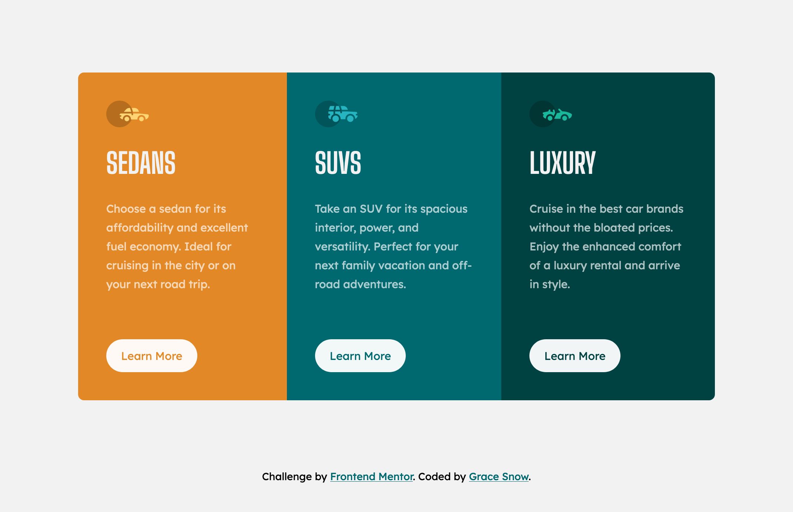

# 3-column preview card component - Frontend Mentor Solution

This is a solution to the [3-column preview card component challenge on Frontend Mentor](https://www.frontendmentor.io/challenges/3column-preview-card-component-pH92eAR2-).

## Table of contents

- [Overview](#overview)
  - [The challenge](#the-challenge)
  - [Links](#links)
- [My process](#my-process)
  - [Built with](#built-with)

## Overview

The purpose of this challenge was simply to practice foundational semantic HTML and scss skills because I've been doing a lot of meetings, accessibility audits and writing documentation recently. It's good to keep skills sharp! ;)

### The challenge

Users should be able to:

- View the optimal layout depending on their device's screen size
- See hover states for interactive elements
- See visible focus states for interactive elements when navigating by keyboard
- Understand and be able to navigate page content while using assistive technology

### Links

- Solution URL: [github.com/grace-snow/fmentor-3-column-preview-card](https://github.com/grace-snow/fmentor-3-column-preview-card)
- Live Site URL: [grace-snow.github.io/fmentor-3-column-preview-card/](https://grace-snow.github.io/fmentor-3-column-preview-card/)

## My process

### Built with

- Semantic HTML5 markup
- CSS custom properties
- Flexbox
- Mobile-first workflow
- Scss (compiled with [Live Sass Compiler](https://marketplace.visualstudio.com/items?itemName=ritwickdey.live-sass) in Vs Code)
